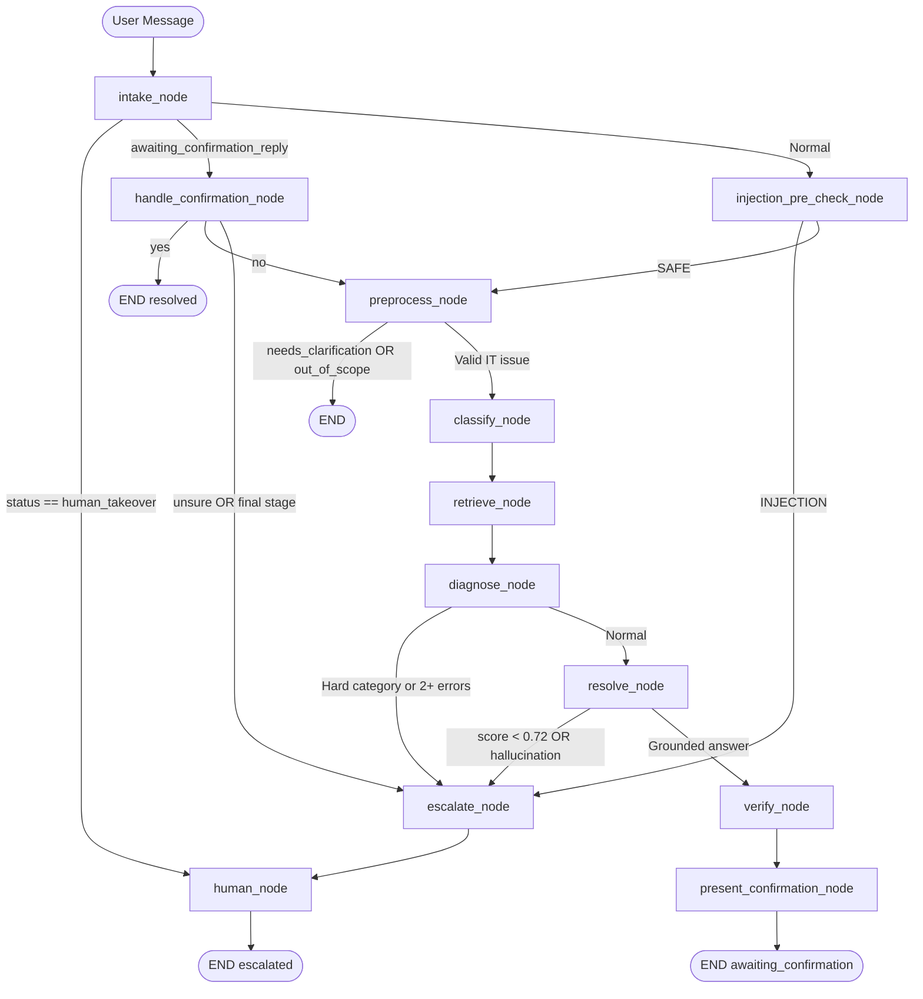

# AI L1 IT Helpdesk — Full Codebase Analysis

> **Updated:** Post `git pull` from `develop/Adrian/ved` branches (2026-09-17)  
> **Tone:** Brutally honest. No filler.

---

## 1. System Architecture Overview

```
┌─────────────────────────────────────────────────────┐
│                   Docker Compose                    │
│                                                     │
│  ┌─────────────┐   ┌──────────────┐  ┌──────────┐  │
│  │  Frontend   │   │   Backend    │  │ Adminer  │  │
│  │  Vite/TS    │   │  FastAPI     │  │  :8080   │  │
│  │   :5173     │──▶│   :8001      │  └──────────┘  │
│  └─────────────┘   └──────┬───────┘                │
│                           │                         │
│                    ┌──────▼───────┐                 │
│                    │  PostgreSQL  │                 │
│                    │  + pgvector  │                 │
│                    │    :5432     │                 │
│                    └──────────────┘                 │
└─────────────────────────────────────────────────────┘
                           │
              ┌────────────▼────────────┐
              │  External LLM Provider  │
              │  Gemini / OpenAI / xAI  │
              │  (configurable via env) │
              └─────────────────────────┘
```

**Tech stack:**
- **Backend**: Python 3.x, FastAPI (async), SQLAlchemy (async), Alembic (migrations), LangGraph, LangChain
- **Database**: PostgreSQL with `pgvector` extension for semantic similarity search
- **Frontend**: Vite + TypeScript
- **LLM**: Pluggable — Gemini Flash (current `.env`), OpenAI, or xAI Grok
- **Observability**: Langfuse (optional, env-gated)

---

## 2. Data Model Layer

### 2.1 Users — [`models/user.py`](file:///c:/Users/AaronNeilRebello/Desktop/Evaluation/helpdesk/backend/src/models/user.py)
Simple user table. `role` field as enum (`employee`, `engineer`, etc.). No MFA, no session table. Auth is JWT-based via `auth/security.py`.

### 2.2 Conversations — [`models/chat.py`](file:///c:/Users/AaronNeilRebello/Desktop/Evaluation/helpdesk/backend/src/models/chat.py)

| Field | Type | Purpose |
|-------|------|---------|
| `id` | UUID | Primary key |
| `user_id` | FK → users | Conversation owner |
| `owner_type` | Enum: `AI / HUMAN` | Who is currently handling this conversation |
| `status` | Enum: `ACTIVE / CLOSED` | Lifecycle state |

**Critical nuance**: `owner_type` and `status` are separate concerns. A conversation is `ACTIVE + owner_type=AI` during normal flow. When AI escalates it becomes `ACTIVE + owner_type=HUMAN`. It only becomes `CLOSED` when explicitly closed by user or engineer.

**`Message` model** stores individual turns. `sender_type` ∈ `{USER, AI, SYSTEM}`. SYSTEM messages (engineer notes, close events) are intentionally excluded from LLM context in `_load_history()`.

### 2.3 Tickets — [`models/ticket.py`](file:///c:/Users/AaronNeilRebello/Desktop/Evaluation/helpdesk/backend/src/models/ticket.py)

| Field | Type | Notable |
|-------|------|---------|
| `status` | Enum | `NEW → TRIAGED → IN_PROGRESS → RESOLVED/CLOSED/ESCALATED` |
| `priority` | Enum | `CRITICAL / HIGH / MEDIUM / LOW` |
| `priority_rationale` | String | Auditable explanation of why priority was assigned |
| `embedding` | `Vector(3072)` | pgvector embedding for similarity search |
| `department` | String | Enables department-scoped retrieval |

**`TicketHistory`** records every status transition with actor and timestamp — this is the audit trail.
**`AuditEvent`** records AI workflow actions with trace IDs — this is the LLM action log.

### 2.4 Knowledge — [`models/knowledge.py`](file:///c:/Users/AaronNeilRebello/Desktop/Evaluation/helpdesk/backend/src/models/knowledge.py)
`KnowledgeDocument` table with `Vector(3072)` embedding, title, content, chunk_index, and optional department filter. The `chunk_index` field supports document chunking. The `kb_articles.json` file is the seed data (1563 lines, extensive IT coverage across hardware, software, network, access, email, and security domains).

---

## 3. Infrastructure

### 3.1 Docker Compose — [`docker-compose.yml`](file:///c:/Users/AaronNeilRebello/Desktop/Evaluation/helpdesk/docker-compose.yml)

Four services: `db` (pgvector), `backend`, `frontend`, `adminer`. Backend runs with `--reload` — dev-only. Fine.

**Issues:**
- `version: '3.8'` is deprecated in newer Docker Compose — produces warnings.
- No health check on the `db` service — `backend` has `depends_on: db` but this only waits for container start, not for Postgres to accept connections. Race condition on fresh `docker compose up`.

### 3.2 Auth — [`auth/security.py`](file:///c:/Users/AaronNeilRebello/Desktop/Evaluation/helpdesk/backend/src/auth/security.py)
JWT-based. `RoleChecker` dependency enforces role-based access on routes. Support roles (`engineer`, `l1`, `l2`, `support_lead`, `admin`) bypass LangGraph for message sending and can see all tickets/conversations. The role set is hardcoded inline in multiple files — should be a shared constant.

---

## 4. API Layer

### 4.1 FastAPI App — [`main.py`](file:///c:/Users/AaronNeilRebello/Desktop/Evaluation/helpdesk/backend/src/main.py)

Clean entry point. `TraceIdMiddleware` attaches a unique trace ID to every request. Langfuse flushed on app shutdown via `lifespan` context. Five routers registered.

### 4.2 Conversations API — [`api/conversations.py`](file:///c:/Users/AaronNeilRebello/Desktop/Evaluation/helpdesk/backend/src/api/conversations.py) (952 lines)

The boundary between HTTP and LangGraph. Most complex file in the codebase.

**`GET /conversations`** — Lists user conversations. **N+1 queries** — one message query + one ticket query per conversation. 50 conversations = 100+ DB round-trips. No pagination.

**`POST /conversations`** — Creates conversation. Auto-creates user record if not found (silently creates users on first access — risky if auth ever fails open).

**`POST /{id}/takeover`** — Engineers claim a conversation. Transitions ticket `ESCALATED → IN_PROGRESS`. Writes `TicketHistory` + `AuditEvent`. Correct and well-implemented.

**`POST /{id}/close`** — Closes conversation. Transitions ticket to `RESOLVED` (engineer) or `CLOSED` (user). Full audit trail. Correct.

**`POST /{id}/messages`** — Core message handler. Five phases:

```
Phase 1: Load conversation history (_load_history → build_bounded_history)
Phase 2: Detect awaiting_confirmation_reply from last AI message markers
Phase 3: Bypass LangGraph if human owns conversation
Phase 4: ainvoke LangGraph with history-aware initial_state
Phase 5: Handle outcomes:
         - confirmation_decision == "resolved" → close ticket, CLOSED
         - is_escalated → create ticket ESCALATED, flip owner_type = HUMAN
```

New messages are isolated via `final_state["messages"][history_len:]` — only genuinely new AI messages get persisted. Smart and correct.

### 4.3 Tickets API — [`api/tickets.py`](file:///c:/Users/AaronNeilRebello/Desktop/Evaluation/helpdesk/backend/src/api/tickets.py)

- `GET /tickets` — All tickets, support-role only. No filtering, no pagination. Full table scan.
- `POST /{id}/resolve` — Engineers resolve ticket. Works correctly.
- `POST /{id}/confirm-resolution` — **Bug: references `ticket.created_by` which does not exist on the `Ticket` model** (field is `user_id`). This endpoint raises `AttributeError` at runtime.
- `GET /{id}/similar` — Vector similarity search for related tickets. Correct reuse of `RetrievalService`.

---

## 5. LangGraph Workflow — Complete Flow

### 5.1 State — [`workflow/state.py`](file:///c:/Users/AaronNeilRebello/Desktop/Evaluation/helpdesk/backend/src/workflow/state.py)

| Field | Purpose |
|-------|---------|
| `messages` | Full conversation history (LangChain messages, accumulates via `add_messages`) |
| `input` | Raw user text this turn |
| `sanitized_query` | Cleaned input + transcript for LLM prompts |
| `needs_clarification` | Preprocess asks a follow-up |
| `escalate` | Trigger escalation path |
| `needs_handoff` | Synonym of `escalate` — redundant |
| `out_of_scope` | Query rejected as non-IT |
| `retrieval_score` | Top cosine similarity from pgvector |
| `category` | Issue category (Access/Network/Hardware/etc.) |
| `priority` | CRITICAL/HIGH/MEDIUM/LOW |
| `priority_rationale` | Human-readable reason for priority |
| `evidence` | Accumulated KB docs + tool results |
| `tool_history` | Tools already run (dedup guard) |
| `status` | active/resolved/escalated/human_takeover/awaiting_confirmation |
| `user_context` | Authenticated user metadata (email, dept, role) |
| `confirmation_decision` | resolved/retry/escalate (NEW) |
| `awaiting_confirmation_reply` | Inside the confirm loop? (NEW) |

### 5.2 Graph Topology — [`workflow/graph.py`](file:///c:/Users/AaronNeilRebello/Desktop/Evaluation/helpdesk/backend/src/workflow/graph.py)



### 5.3 Node-by-Node Analysis

#### `intake_node` — [`nodes/intake.py`](file:///c:/Users/AaronNeilRebello/Desktop/Evaluation/helpdesk/backend/src/workflow/nodes/intake.py)
Returns `{"input": state.get("input", "")}`. **Still a no-op.** The meaningful logic (takeover/confirmation routing) lives in the edge function `check_takeover`, not in the node. The node adds a graph hop for zero value.

#### `injection_pre_check_node` — [`nodes/intake.py`](file:///c:/Users/AaronNeilRebello/Desktop/Evaluation/helpdesk/backend/src/workflow/nodes/intake.py)
- LLM classifier: returns `INJECTION` or `SAFE`
- Deterministic fallback: regex patterns for common injection phrases
- Defense-in-depth approach is correct
- **Issue**: LLM call fires before keyword check. Minor — the prompt is short so latency is low, but the pattern is inconsistent with the stated design philosophy

#### `preprocess_node` — [`nodes/triage.py`](file:///c:/Users/AaronNeilRebello/Desktop/Evaluation/helpdesk/backend/src/workflow/nodes/triage.py)

Significantly reworked. Two paths:

**Cold open (turn 0):**
1. Rejects greetings/vague inputs with `needs_clarification=True`
2. Calls `is_it_support_query()` — LLM scope check
3. `out_of_scope=True` if non-IT

**Subsequent turns (turn > 0):**
1. `_is_hard_topic_pivot()` — cheap regex (food delivery, jokes, etc.)
2. If no hard pivot → `_transcript_still_on_topic()` — LLM check using full transcript
3. If pivoted → `out_of_scope=True`
4. LLM sufficiency check — returns clarifying question if more info needed
5. Hard cap at `MAX_CLARIFICATION_ROUNDS=5` — proceeds regardless after cap

**What's good:** Two-path design is correct. Scope check runs only once (cold open). Topic continuity handles follow-ups without full re-scope. Clarification is bounded.

**Issues:**
- `_transcript_still_on_topic()` fires LLM on every follow-up, even for obvious continuations like "still broken" or "that didn't work"
- `is_it_support_query()` still calls LLM before keywords
- `PERSONA_VOICE` constant defined here but not used by `classify_node` or `resolve_node` — inconsistent tone

#### `classify_node` — [`nodes/triage.py`](file:///c:/Users/AaronNeilRebello/Desktop/Evaluation/helpdesk/backend/src/workflow/nodes/triage.py)
LLM call → JSON: `{category, priority, rationale}`. Validates against allowlists. Fallback: keyword-based priority assignment. Correct. No changes in this PR.

**Issue**: By turn 2+, `sanitized_query` is the full multi-turn transcript. The classify prompt says "Classify the IT issue" without specifying it's a transcript. The LLM should be explicitly told the structure.

#### `retrieve_node` — [`nodes/retrieval.py`](file:///c:/Users/AaronNeilRebello/Desktop/Evaluation/helpdesk/backend/src/workflow/nodes/retrieval.py)
Async pgvector cosine distance queries. `MIN_DOC_SCORE=0.55` floor — documents below this are excluded. Falls back to keyword search if embeddings unavailable. No early exit when KB score is already high — both KB and ticket queries always run.

#### `diagnose_node` — [`nodes/resolution.py`](file:///c:/Users/AaronNeilRebello/Desktop/Evaluation/helpdesk/backend/src/workflow/nodes/resolution.py)
Dual tool dispatch — still present:
1. `select_mock_tool()` keyword match → calls gateway directly
2. LLM `bind_tools()` → may call same tool again via LLM decision

`tool_history` prevents double execution but the LLM call still fires. Both paths hardcode `target_id="mock123"`. Tool evidence is meaningless (all mocked, wrong user identity).

#### `resolve_node` — [`nodes/resolution.py`](file:///c:/Users/AaronNeilRebello/Desktop/Evaluation/helpdesk/backend/src/workflow/nodes/resolution.py)
The duplicate `is_it_support_query()` call **has been removed** — improvement from audit. Now simply escalates on low score: `if retrieval_score < SIMILARITY_THRESHOLD: escalate`. Duplicate tool dispatch still present (lines 100-108). Grounding check still word-overlap based.

#### `verify_node` — [`nodes/resolution.py`](file:///c:/Users/AaronNeilRebello/Desktop/Evaluation/helpdesk/backend/src/workflow/nodes/resolution.py)
`return {"status": state.get("status", "resolved")}`. **Still a no-op.** Now routes to `present_confirmation` instead of `END`.

#### `present_confirmation_node` — [`nodes/confirmation.py`](file:///c:/Users/AaronNeilRebello/Desktop/Evaluation/helpdesk/backend/src/workflow/nodes/confirmation.py)
**New in this PR.** Appends a resolution confirmation prompt with invisible Unicode markers embedded in the message content. First prompt = `CONFIRM_MARKER`. Second prompt (after retry) = `CONFIRM_FINAL_MARKER`. No LLM call — pure template. Correct.

**Fragility**: Markers live inside `Message.content` in the DB. If the frontend strips or normalizes content (trimming whitespace, sanitizing Unicode), markers are silently lost and confirmation routing breaks.

#### `handle_confirmation_node` — [`nodes/confirmation.py`](file:///c:/Users/AaronNeilRebello/Desktop/Evaluation/helpdesk/backend/src/workflow/nodes/confirmation.py)
Classifies user reply:
1. Deterministic regex for explicit escalation requests (checked first, honors immediately)
2. LLM: returns `YES / NO / UNSURE / ESCALATE`
3. Keyword fallback: `_YES` and `_NO` regex

Routing: `yes` → END (resolved), `no` → back to `preprocess` (retry), `unsure` → escalate, `escalate` → escalate immediately.

**Bug**: `_NO` regex is `\b(2|no|nope|still|not working|didn'?t work|same issue)\b` — "2" is captured here. Wait, checking the actual pattern: `r"\b(2|no|nope|still|not working|didn'?t work|same issue)\b"`. Yes, "2" is in `_NO`. So "2" *would* route to `no` (retry). This works.

**Actual issue**: `_YES` is `r"\b(1|yes|yep|yeah|resolved|fixed|works?|solved)\b"`. If a user says "no, 1 still doesn't work" — both `_YES` (`1`) and `_NO` (`no`) match. The logic is `if _YES.search and not _NO.search → yes`. So this correctly returns "no" because `_NO` also matches. But if a user says "1" alone — both `_YES` (`1`) matches, `_NO` doesn't → correctly returns "yes". This is actually fine.

**Real issue**: The `no` → `preprocess` retry path re-runs the full classify → retrieve → diagnose → resolve → confirm chain. The second classification may assign a different category/priority. If escalation happens on the retry, the ticket is created with the second classification's data, not the first. Inconsistent.

#### `escalate_node` / `handoff_node` — [`nodes/handoff.py`](file:///c:/Users/AaronNeilRebello/Desktop/Evaluation/helpdesk/backend/src/workflow/nodes/handoff.py)
Creates structured escalation summary in evidence. Adds user-facing message. Sets `status=escalated`. Routes to `human_node`.

#### `human_node` — [`nodes/handoff.py`](file:///c:/Users/AaronNeilRebello/Desktop/Evaluation/helpdesk/backend/src/workflow/nodes/handoff.py)
Sets `status=human_takeover`. Routes to END. API layer flips `conversation.owner_type = HUMAN` and creates the ticket.

---

## 6. Retrieval Service — [`services/retrieval_service.py`](file:///c:/Users/AaronNeilRebello/Desktop/Evaluation/helpdesk/backend/src/services/retrieval_service.py)

### Changes in This PR
- `MIN_DOC_SCORE=0.55` floor: documents below this score discarded before evidence
- Keyword fallback score cap fixed: max is now `0.70` (below `SIMILARITY_THRESHOLD=0.72`) — **closes the backdoor that bypassed the similarity guard**

### Remaining Issues
- Keyword fallback `_keyword_fallback()` fetches ALL KB documents with no LIMIT — full table scan, then scores in Python. On large KB this is slow and memory-heavy.
- Both KB and ticket pgvector queries always run — no early exit when KB score already exceeds threshold.
- Dead code in `_keyword_fallback()`: redundant `hasattr(x, "__await__")` checks on synchronous SQLAlchemy `ScalarResult` objects.
- No pgvector index type specified in models — HNSW or IVFFlat index on `embedding` column is needed for performance at scale.

---

## 7. History Utils — [`workflow/utils/history_utils.py`](file:///c:/Users/AaronNeilRebello/Desktop/Evaluation/helpdesk/backend/src/workflow/utils/history_utils.py)

**New file.** Implements bounded conversation history:
- Keeps last `RECENT_HISTORY_KEEP=10` messages verbatim
- Condenses older messages into a single `SystemMessage` summary via LLM call
- Fallback: naive 500-char truncation if LLM unavailable

**What's good**: Correct pattern. Memory without unbounded prompt growth.

**Issue**: Summary is recomputed every turn once history exceeds 10 messages. The summary of messages 1-2 should be computed once and cached, not recomputed on turn 3, 4, 5... An extra LLM call per turn on long conversations.

---

## 8. Guardrails — [`workflow/utils/guardrails.py`](file:///c:/Users/AaronNeilRebello/Desktop/Evaluation/helpdesk/backend/src/workflow/utils/guardrails.py)

### `sanitize_input` — Improved in This PR
Now strips zero-width Unicode characters and bidi overrides — a real prompt injection vector the old version missed. Correctly removed SQL comment stripping (`;`, `--`) which was mangling legitimate IT text. Correct.

### `is_it_support_query` — Unchanged Problem
Fires LLM call before checking `_IT_KEYWORDS`. For "my VPN keeps dropping" the keyword `"vpn"` would immediately return `True`, but the LLM is called first. ~100-150ms wasted per cold-open IT query.

### `is_response_from_knowledge_base` — Unchanged Problem
Word-overlap grounding check. Passes if answer shares 3+ words longer than 5 chars with KB content. Common IT vocabulary like "password", "network", "access" appears in almost every KB article and almost every plausible answer. An LLM could hallucinate a completely wrong resolution procedure and still pass this check if it uses common IT terms. This is the weakest link in the entire system.

### `select_mock_tool` — Minor Issue
Triggers `device_check` on any query containing "laptop". "I need a new laptop" — not a device compliance issue, but this would trigger the tool. Keyword is too broad.

---

## 9. Constants — [`workflow/constants.py`](file:///c:/Users/AaronNeilRebello/Desktop/Evaluation/helpdesk/backend/src/workflow/constants.py)

| Constant | Value | Issue |
|----------|-------|-------|
| `SIMILARITY_THRESHOLD` | 0.72 | Configurable. Correct. |
| `LLM_TEMPERATURE` | 0.0 | Correct for deterministic helpdesk output. |
| `LLM_SEED` | 42 | **No effect on Gemini** — `ChatGoogleGenerativeAI` ignores `seed`. Determinism goal not achieved with current provider. |
| `MAX_CLARIFICATION_ROUNDS` | 5 | Bounded. Correct. |
| `MIN_DOC_SCORE` | 0.55 | New. Correct relevance floor. |
| `RECENT_HISTORY_KEEP` | 10 | New. Reasonable bound. |
| `CONFIRM_MARKER` | `\u200b\u200c\u200b` | Zero-width Unicode. Clever but fragile if content is normalized. |
| `CONFIRM_FINAL_MARKER` | `\u200b\u200c\u200c\u200b` | Same issue. |

---

## 10. Observability — [`core/observability.py`](file:///c:/Users/AaronNeilRebello/Desktop/Evaluation/helpdesk/backend/src/core/observability.py)

Langfuse opt-in via env. Lazy initialization. Graceful degradation. Per-invocation metadata: session_id, user_id, department, role, owner_type. Flush on shutdown via `lifespan`.

**Issue**: SIGKILL kills the process without running `lifespan` teardown — Langfuse events buffered in-memory are lost. Production deployments should handle `SIGTERM` explicitly.

---

## 11. LLM Call Budget (Current State)

### Happy Path — First Message

| Step | Node | Reason | ~Tokens |
|------|------|--------|---------|
| 1 | `injection_pre_check` | INJECTION/SAFE verdict | ~300 |
| 2 | `preprocess` | `is_it_support_query()` LLM | ~300 |
| 3 | `preprocess` | Sufficiency check | ~400 |
| 4 | `classify` | Category + priority JSON | ~400 |
| 5 | `diagnose` | Tool binding LLM | ~500 |
| 6 | `resolve` | Answer generation | ~800 |
| — | `present_confirmation` | Template, no LLM | — |
| **Total** | | **6 LLM calls** | **~2700 tokens** |

### Happy Path — Follow-Up Message (Turn 2+)

| Step | Node | Reason | ~Tokens |
|------|------|--------|---------|
| 1 | `injection_pre_check` | INJECTION/SAFE | ~300 |
| 2 | `history_utils` | Summary (if >10 msgs) | ~500 |
| 3 | `preprocess` | Topic continuity LLM | ~500 |
| 4 | `preprocess` | Sufficiency check | ~400 |
| 5 | `classify` | Re-classify with transcript | ~600 |
| 6 | `diagnose` | Tool binding LLM | ~500 |
| 7 | `resolve` | Answer generation | ~900 |
| **Total** | | **6-7 LLM calls** | **~3700 tokens** |

On Gemini Flash at ~$0.0000375/1K tokens: **~$0.001-0.002/message** in LLM costs. The real concern is **latency**: 6 sequential calls at 100-400ms each = **600ms–2.4 seconds** of pure LLM wait time, before DB and embedding overhead.

---

## 12. Bugs (Runtime Errors)

| # | Bug | File | Line | Description |
|---|-----|------|------|-------------|
| B1 | `AttributeError: 'Ticket' object has no attribute 'created_by'` | [`api/tickets.py`](file:///c:/Users/AaronNeilRebello/Desktop/Evaluation/helpdesk/backend/src/api/tickets.py) | 67 | `confirm-resolution` endpoint references non-existent field — crashes at runtime |

---

## 13. What This PR Got Right

| Feature | Why It's Good |
|---------|--------------|
| **Conversation history loading** | Fixed the biggest functional gap — multi-turn support now actually works |
| **`build_bounded_history()`** | Correct pattern — keeps recent verbatim, summarizes old, never drops silently |
| **Confirmation loop** | User-friendly — doesn't immediately escalate after first AI attempt |
| **Invisible Unicode markers** | Renderer-agnostic routing signal — clever and correct |
| **Hard escalation on human request** | "Talk to a human" is honored immediately, unconditionally |
| **Keyword fallback score cap at 0.70** | Closes the backdoor that bypassed the similarity guard |
| **`MIN_DOC_SCORE=0.55` floor** | Prevents junk documents from polluting evidence |
| **Duplicate scope check removed from `resolve_node`** | Cost fix from audit — done |
| **Topic continuity on follow-ups** | Prevents ignoring obvious topic pivots in multi-turn chats |
| **Zero-width Unicode stripping in sanitize** | Real injection vector now handled |
| **Original issue preserved in ticket title** | "Yes, fixed" no longer becomes ticket description |
| **History slicing** (`final_state["messages"][history_len:]`) | Only new AI messages persisted — no duplication |

---

## 14. All Remaining Issues — Prioritized

### 🔴 Critical (Fix Immediately)

| # | Issue | File | Fix |
|---|-------|------|-----|
| C1 | `confirm-resolution` crashes — `ticket.created_by` doesn't exist | `tickets.py:67` | Change to `ticket.user_id` |
| C2 | `is_response_from_knowledge_base()` is word-overlap theater, passes hallucinations | `guardrails.py:54-176` | Replace with embedding cosine similarity |
| C3 | `target_id="mock123"` — tools never tied to real user | `resolution.py:44,103` | Pass `user_context.get("email")` |

### 🟡 Significant (Fix Soon)

| # | Issue | File | Fix |
|---|-------|------|-----|
| S1 | `is_it_support_query()` runs LLM before keywords | `guardrails.py:248` | Move keyword check above LLM call |
| S2 | `_transcript_still_on_topic()` fires LLM on every follow-up | `triage.py:61` | Add keyword pre-filter before LLM |
| S3 | Dual tool dispatch in `diagnose_node` AND `resolve_node` | `resolution.py` | Remove tool dispatch from `resolve_node` |
| S4 | History summary recomputed every turn | `history_utils.py` | Cache summary as `SYSTEM` message in DB |
| S5 | Retry path re-classifies — inconsistent category on escalation | `triage.py → classify` | Persist first-turn category/priority in state and skip re-classify on retry |
| S6 | N+1 queries in `GET /conversations` | `conversations.py:107` | Use `selectinload` or JOIN |
| S7 | `LLM_SEED=42` has no effect on Gemini | `constants.py` | Document this limitation or switch provider |

### 🟠 Architecture / Polish

| # | Issue | File | Fix |
|---|-------|------|-----|
| A1 | `intake_node` is a no-op | `intake.py` | Delete or give it real responsibility |
| A2 | `verify_node` is a no-op | `resolution.py` | Implement (empty-response check) or delete |
| A3 | `escalate` and `needs_handoff` are redundant | `state.py` | Remove `needs_handoff`, use only `escalate` |
| A4 | `GET /tickets` — no filtering, no pagination | `tickets.py` | Add query params: `status=`, `priority=`, `page=` |
| A5 | No DB health check in `docker-compose.yml` | `docker-compose.yml` | Add `healthcheck` on `db` service |
| A6 | CONFIRM_MARKERs stored raw in DB — fragile | `chat.py` | Consider storing confirmation state separately in `Conversation` table |
| A7 | `_keyword_fallback()` full table scan | `retrieval_service.py` | Add `LIMIT` to fallback query; use PostgreSQL full-text search instead |
| A8 | Support role list hardcoded in multiple files | Various | Extract to shared `SUPPORT_ROLES` constant in `auth/security.py` |
| A9 | `GET /tickets` shows all departments to all engineers | `tickets.py` | Filter by `ticket.department == user.department` unless admin |
| A10 | No pgvector index type specified | `models/knowledge.py` | Add HNSW index on embedding columns in Alembic migration |
