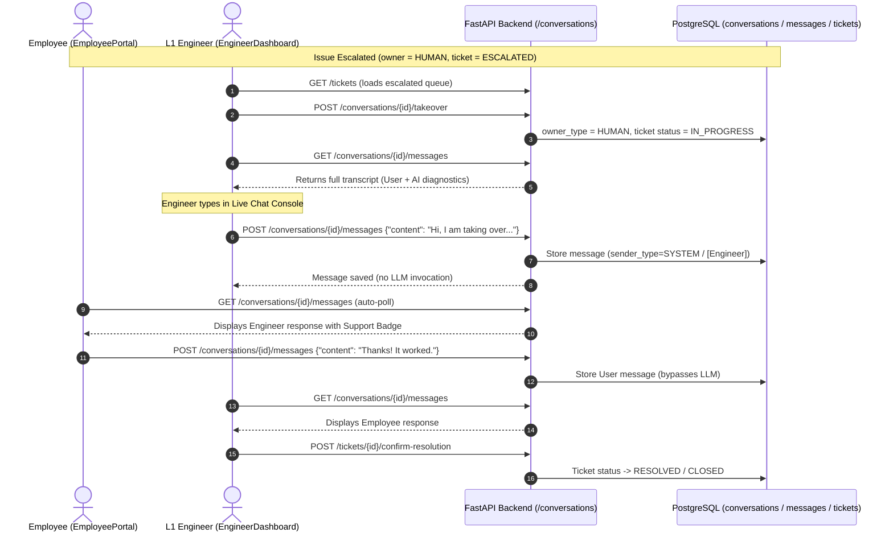

# Engineer Live Chat & Takeover Messaging: Phase-Wise Task List

**Target Module**: AI Helpdesk Engineer Dashboard & Takeover Workflow  
**Created**: 2026-09-08  
**Status**: Ready for Execution  

---

## Architecture & Communication Flow



---

## Phase-Wise Task Breakdown

### Phase 1: Backend Message History & Support Messaging Endpoints
- [x] **Task 1.1**: Add `GET /conversations/{conversation_id}/messages` in `backend/src/api/conversations.py` to return the full chronological transcript (`[{ id, sender_type, content, created_at }]`) with access control for the conversation owner or support staff (`engineer`, `l1`, `l2`, `support_lead`, `admin`).
- [x] **Task 1.2**: Update `POST /conversations/{conversation_id}/messages` in `backend/src/api/conversations.py`:
  - If sender role is `l1`, `l2`, `engineer`, `admin`: save message with `sender_type = SenderType.SYSTEM` (prefixed with `[Engineer] {content}`) and return immediately without invoking LangGraph.
  - If sender role is `employee` and `owner_type == ConversationOwner.HUMAN`: save employee message and return without invoking the AI.
- [x] **Task 1.3**: Update `POST /conversations/{conversation_id}/takeover` to automatically transition any linked `Ticket.status` from `ESCALATED` to `IN_PROGRESS` and record `TicketHistory` + `AuditEvent`.
- [x] **Task 1.4**: Add `POST /tickets/{ticket_id}/resolve` in `backend/src/api/tickets.py` to allow engineers to mark in-progress tickets as `RESOLVED`.

### Phase 2: Frontend API Contracts & Client Integration
- [x] **Task 2.1**: Define `ChatMessageRecord` and updated response shapes in `frontend/src/api/types.ts`:
  ```typescript
  export interface ChatMessageRecord {
    id: string;
    sender_type: 'USER' | 'AI' | 'SYSTEM';
    content: string;
    created_at: string | null;
  }
  ```
- [x] **Task 2.2**: Implement `getConversationMessages(conversationId)`, `sendMessage(conversationId, content)`, and `resolveTicket(ticketId)` in `frontend/src/api/client.ts`.

### Phase 3: Engineer Dashboard Live Chat Console
- [x] **Task 3.1**: Refactor `frontend/src/portals/EngineerDashboard.tsx` into a 2-column layout:
  - **Left Pane**: Ticket queue with status indicators (`ESCALATED`, `IN_PROGRESS`, `RESOLVED`) and active ticket selector.
  - **Right Pane**: Active conversation console displaying full message history (User, AI diagnostic evidence, Engineer responses).
- [x] **Task 3.2**: Add an Engineer Chat Input bar with send button, Enter-to-send support, and disabled/sending states.
- [x] **Task 3.3**: Add a 3-second polling interval for the active ticket conversation so incoming employee replies appear in real-time.
- [x] **Task 3.4**: Add action controls on the active ticket header: **[Take Over Chat]**, **[Mark Resolved]**, and **[Close Ticket]**.

### Phase 4: Employee Portal Live Polling & Support Badging
- [x] **Task 4.1**: Add a periodic message poll (every 3 seconds) in `frontend/src/portals/EmployeePortal.tsx` when a conversation is active.
- [x] **Task 4.2**: Render engineer messages with a dedicated **Support Engineer** badge and distinct visual styling (`.message.support`).

### Phase 5: Styling & Polish
- [x] **Task 5.1**: Add CSS styles in `frontend/src/styles.css` for the two-column dashboard layout, engineer chat stream, ticket sidebar items, and support agent message bubbles.

### Phase 6: End-to-End Verification & Logging
- [x] **Task 6.1**: Run backend compilation and frontend build/lint checks (`npm run build`, `npm run lint`).
- [ ] **Task 6.2**: Execute a live two-way chat test between an employee window and an engineer window.
- [ ] **Task 6.3**: Verify ticket status transitions (`ESCALATED` -> `IN_PROGRESS` -> `RESOLVED`) and log the completed phase in `Ved_log.md`.
