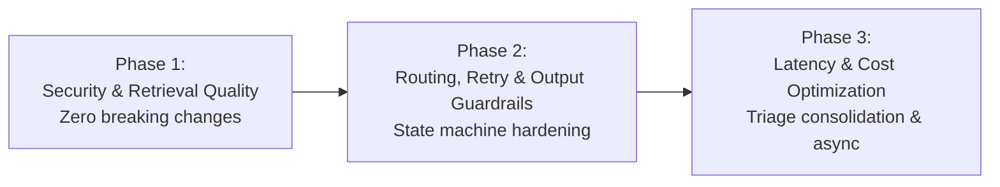

# Phased LangGraph Overhaul & Implementation Plan

This plan breaks down the remediation of all identified architectural flaws into **3 sequential, low-risk, testable phases**. Each phase is self-contained and leaves the system in a working, passing state.

---

## Phase Overview

| Phase | Focus Area | Impact | Affected Files | Risk |
| :--- | :--- | :--- | :--- | :---: |
| **Phase 1** | Security Invariants & Embedding Quality | Closes injection bypass, stops vector search degradation, eliminates context duplication | `graph.py`, `state.py`, `triage.py`, `retrieval.py`, `resolution.py`, `guardrails.py` | **Low** |
| **Phase 2** | State Machine & Verification | Fixes confirmation retry degradation, synchronizes escalation flags, activates `verify_node` | `graph.py`, `confirmation.py`, `resolution.py`, `escalation.py`, `conversations.py` | **Low** |
| **Phase 3** | Latency, Cost & Async Runtime | Collapses 5-7 LLM calls to 1-2, converts sync nodes to async `ainvoke`, eliminates threadpool stalls | `triage.py`, `resolution.py`, `intake.py`, `tests/` | **Medium** |

---

## Detailed Phases

### Phase 1: Security Invariants, Retrieval Quality & Context Deduplication
**Goal:** Seal immediate security vulnerabilities and fix vector retrieval degradation on multi-turn conversations without altering high-level graph topology.

#### Proposed Changes
1. **Fix Security Hole in Graph Entry Routing:**
   - In [`graph.py`](file:///c:/Users/AaronNeilRebello/Desktop/Evaluation/helpdesk/backend/src/workflow/graph.py):
     Route `intake` directly to `injection_pre_check` for all incoming messages (unless already in `human_takeover`).
     Only *after* the injection pre-check verifies the message is `SAFE` does the graph route to `handle_confirmation` if `awaiting_confirmation_reply` is True.
     *Impact:* Prevents jailbreak payloads from bypassing security when replying to confirmation prompts.

2. **Decouple Search Query from Multi-turn Transcript:**
   - In [`state.py`](file:///c:/Users/AaronNeilRebello/Desktop/Evaluation/helpdesk/backend/src/workflow/state.py):
     Add `search_query: str` to `AgentState`.
   - In [`triage.py`](file:///c:/Users/AaronNeilRebello/Desktop/Evaluation/helpdesk/backend/src/workflow/nodes/triage.py):
     Stop setting `sanitized_query` to the full 1,000-word conversation transcript. Keep `sanitized_query` as the clean sanitized current turn, and set `search_query` as the extracted core technical problem.
   - In [`retrieval.py`](file:///c:/Users/AaronNeilRebello/Desktop/Evaluation/helpdesk/backend/src/workflow/nodes/retrieval.py):
     Query the vector database using `state.get("search_query") or state.get("sanitized_query")`.
     Deduplicate document evidence so retries do not accumulate redundant copies.
     *Impact:* Vector similarity scores remain accurate across multi-turn dialogs; stops false low-score escalations.

3. **Protect Zero-Width Confirmation Markers in Sanitizer:**
   - In [`guardrails.py`](file:///c:/Users/AaronNeilRebello/Desktop/Evaluation/helpdesk/backend/src/workflow/utils/guardrails.py):
     Update `sanitize_input` so regex cleaning preserves `CONFIRM_MARKER` and `CONFIRM_FINAL_MARKER`.

4. **Eliminate Double-Context Duplication:**
   - In [`resolution.py`](file:///c:/Users/AaronNeilRebello/Desktop/Evaluation/helpdesk/backend/src/workflow/nodes/resolution.py):
     In `diagnose_node`, pass the prompt with `SystemMessage` and `messages`. Remove `HumanMessage(content=sanitized_query)` which duplicated the entire conversation.

5. **Remove Duplicate Tool Call in `resolve_node`:**
   - In [`resolution.py`](file:///c:/Users/AaronNeilRebello/Desktop/Evaluation/helpdesk/backend/src/workflow/nodes/resolution.py):
     Remove the redundant call to `select_mock_tool` in `resolve_node` since `diagnose_node` already executed it.

#### Verification
- Run test suite: `docker exec -e PYTHONPATH=/app helpdesk-backend-1 pytest tests/ -v`.
- Verify prompt injection during confirmation turn triggers security alert.
- Verify multi-turn vector retrieval uses clean search query.

---

### Phase 2: State Machine Resilience, Retry Routing & Active Verification
**Goal:** Make the workflow robust against state desynchronization, fix confirmation retry degradation, and activate output guardrails.

#### Proposed Changes
1. **Resilient Confirmation Retry Path:**
   - In [`graph.py`](file:///c:/Users/AaronNeilRebello/Desktop/Evaluation/helpdesk/backend/src/workflow/graph.py) and [`confirmation.py`](file:///c:/Users/AaronNeilRebello/Desktop/Evaluation/helpdesk/backend/src/workflow/nodes/confirmation.py):
     When the user says *"No, still broken"* (`decision == "retry"`), route directly to `retrieve` / `diagnose` with the user's updated diagnostic context.
     **Do not** route back to `classify`—the category and priority already established in turn 1 must be preserved.
     *Impact:* Prevents ticket metadata corruption on user retries.

2. **Synchronize Escalation Flags:**
   - In [`state.py`](file:///c:/Users/AaronNeilRebello/Desktop/Evaluation/helpdesk/backend/src/workflow/state.py), [`escalation.py`](file:///c:/Users/AaronNeilRebello/Desktop/Evaluation/helpdesk/backend/src/workflow/escalation.py), and [`conversations.py`](file:///c:/Users/AaronNeilRebello/Desktop/Evaluation/helpdesk/backend/src/api/conversations.py):
     Ensure whenever a node triggers escalation, all three flags (`status="escalated"`, `escalate=True`, `needs_handoff=True`) are set consistently.

3. **Activate `verify_node` as an Output Guardrail:**
   - In [`resolution.py`](file:///c:/Users/AaronNeilRebello/Desktop/Evaluation/helpdesk/backend/src/workflow/nodes/resolution.py):
     Replace the dead `verify_node` no-op with an active post-generation safety verification:
     - Check for internal system prompt leakage (e.g. "You are an AI IT Helpdesk Assistant", rule disclosures).
     - Check for accidental credential/token exposure in the response.
     - If flagged, redact or safely hand off to human support.

4. **Improve Grounding Check Robustness:**
   - In [`guardrails.py`](file:///c:/Users/AaronNeilRebello/Desktop/Evaluation/helpdesk/backend/src/workflow/utils/guardrails.py):
     Refactor `is_response_from_knowledge_base` to check for core technical entity overlap and tool output alignment, eliminating the fragile 3-word >5-char heuristic that causes false rejections.

#### Verification
- Test confirmation retry flow: verify priority & category do not change when user says "No, didn't work".
- Test `verify_node`: simulate prompt leak in generated text and verify it is caught before user delivery.

---

### Phase 3: Latency & Cost Optimization (Triage Consolidation & Async-First)
**Goal:** Dramatically reduce turn latency (from ~8s down to <2.5s) and token costs by collapsing sequential LLM calls and enabling async execution.

#### Proposed Changes
1. **Consolidate Triage & Classification into One Single LLM Call:**
   - In [`triage.py`](file:///c:/Users/AaronNeilRebello/Desktop/Evaluation/helpdesk/backend/src/workflow/nodes/triage.py):
     Replace the 3 sequential checks (`is_it_support_query`, sufficiency LLM, and `classify_node`) with a unified `triage_node`:
     - Fast regex catches greetings & obvious non-IT requests instantly with 0 LLM calls.
     - Single structured assessment prompt: evaluates scope, checks clarification sufficiency, extracts `search_query`, and classifies category/priority simultaneously in one single call.
     *Impact:* Cuts 2 full LLM calls and ~1,500 prompt tokens per turn.

2. **Async-First Execution:**
   - In [`intake.py`](file:///c:/Users/AaronNeilRebello/Desktop/Evaluation/helpdesk/backend/src/workflow/nodes/intake.py), [`triage.py`](file:///c:/Users/AaronNeilRebello/Desktop/Evaluation/helpdesk/backend/src/workflow/nodes/triage.py), [`resolution.py`](file:///c:/Users/AaronNeilRebello/Desktop/Evaluation/helpdesk/backend/src/workflow/nodes/resolution.py), and [`confirmation.py`](file:///c:/Users/AaronNeilRebello/Desktop/Evaluation/helpdesk/backend/src/workflow/nodes/confirmation.py):
     Convert all node functions to `async def` using `await llm.ainvoke(...)`.
     *Impact:* Eliminates thread-pool blocking in FastAPI and allows true non-blocking concurrent request handling.

3. **Comprehensive Regression & Performance Suite:**
   - Add unit and integration tests in `tests/workflow/test_graph_optimization.py` validating:
     - End-to-end token and LLM call counts.
     - Security routing invariants.
     - Multi-turn state persistence.

#### Verification
- Run all unit and integration tests: `docker exec -e PYTHONPATH=/app helpdesk-backend-1 pytest tests/ -v`.
- Measure latency before and after Phase 3 to confirm >60% drop in response time.

---

## Execution Recommendation

We recommend proceeding with **Phase 1 first**, running the test suite to verify baseline stability, then proceeding through **Phase 2** and **Phase 3**.
