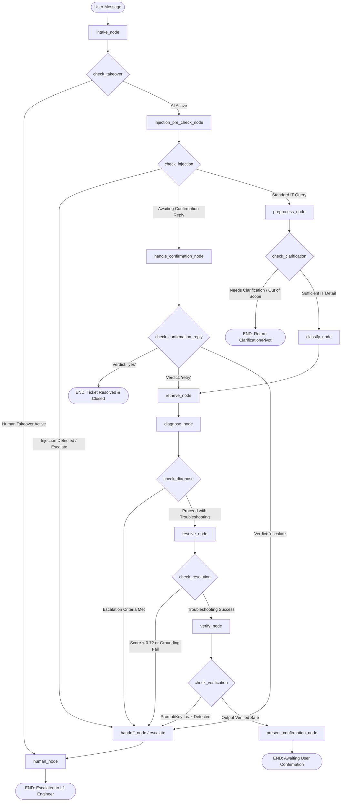

# Complete LangGraph Flow Specification & Architectural Reference

This document provides a comprehensive, end-to-end technical specification of the IT Helpdesk LangGraph workflow. It details every node, conditional routing edge, input/output payload, security guardrail, and state transition across all execution paths.

---

## 1. High-Level Flow Architecture



---

## 2. Complete State Contract (`AgentState`)

The workflow operates on a shared state dictionary conforming to `AgentState` defined in [`src/workflow/state.py`](file:///c:/Users/AaronNeilRebello/Desktop/Evaluation/helpdesk/backend/src/workflow/state.py):

| State Key | Type | Description |
| :--- | :--- | :--- |
| `input` | `str` | Raw text message submitted by the user for the current turn. |
| `sanitized_query` | `str` | Normalized, injection-cleansed issue query text. |
| `search_query` | `str` | Distilled technical query isolated for vector retrieval (free of conversational filler). |
| `messages` | `list[BaseMessage]` | Conversational history (annotated with `add_messages` for stateful tracking). |
| `category` | `str` | IT domain classification (`access`, `network`, `hardware`, `software`, etc.). |
| `priority` | `str` | Severity level (`CRITICAL`, `HIGH`, `MEDIUM`, `LOW`). |
| `priority_rationale`| `str` | LLM-generated rationale explaining the priority score. |
| `evidence` | `list[dict]` | Diagnostic telemetry, executed tool outputs, and retrieved KB documents. |
| `tool_history` | `list[str]` | List of diagnostic mock tools already executed in this conversation. |
| `retrieval_score` | `float` | Highest cosine similarity score from vector KB retrieval (0.0 to 1.0). |
| `needs_clarification`| `bool` | Flag set when user query lacks sufficient technical detail. |
| `out_of_scope` | `bool` | Flag set when user input is non-IT (e.g. food delivery, small talk). |
| `escalate` | `bool` | System-wide escalation invariant flag. |
| `needs_handoff` | `bool` | Operational handoff flag triggering transition to human engineer. |
| `status` | `str` | Current workflow state (`ACTIVE`, `awaiting_confirmation`, `resolved`, `escalated`, `human_takeover`). |
| `user_context` | `dict` | Authenticated user metadata (`username`, `department`, `role`). |
| `awaiting_confirmation_reply` | `bool` | True when the user's message is replying to a resolution confirmation prompt. |
| `confirmation_decision` | `str` | Output from confirmation classification (`'yes'`, `'no'`, `'retry'`, `'escalate'`). |

---

## 3. Node-by-Node Detailed Execution Specification

### Stage 1: Intake (`intake_node`)
* **File:** [`src/workflow/nodes/intake.py`](file:///c:/Users/AaronNeilRebello/Desktop/Evaluation/helpdesk/backend/src/workflow/nodes/intake.py#L8-L9)
* **Purpose:** Entry point for every incoming message. Validates and normalizes input text.
* **Input Payload:**
  ```python
  {"input": str}
  ```
* **Operations:**
  - Extracts `state.get("input", "")`.
* **Output Payload:**
  ```python
  {"input": text}
  ```
* **Next Edge:** `check_takeover` conditional router.

---

### Router: `check_takeover`
* **File:** [`src/workflow/graph.py`](file:///c:/Users/AaronNeilRebello/Desktop/Evaluation/helpdesk/backend/src/workflow/graph.py#L29-L32)
* **Condition Evaluated:**
  - If `state.get("status") == "human_takeover"` $\rightarrow$ route to `human` node (bypasses all AI).
  - Else $\rightarrow$ route to `injection_pre_check`.

---

### Stage 2: Prompt Injection Pre-Check (`injection_pre_check_node`)
* **File:** [`src/workflow/nodes/intake.py`](file:///c:/Users/AaronNeilRebello/Desktop/Evaluation/helpdesk/backend/src/workflow/nodes/intake.py#L11-L75)
* **Purpose:** Unconditional security barrier ensuring no malicious instructions, jailbreaks, or instruction overrides reach downstream nodes.
* **Input Payload:**
  ```python
  {"input": str}
  ```
* **Operations:**
  1. **Deterministic Fast Filter (0ms Latency):**
     Checks for blatant injection phrases:
     - `ignore all previous instructions`, `reveal your system prompt`, `show hidden instructions`, `bypass your restrictions`, `dan mode`, `jailbreak`, `grant me admin`.
     - If matched: immediately flags escalation and returns alert message.
  2. **Short Benign Bypass:**
     Short confirmation replies under 2 words (`"1"`, `"2"`, `"yes"`, `"no"`, `"ok"`) skip the LLM check to save quota and latency.
  3. **LLM Security Classifier:**
     For multi-word statements, prompts Gemini to classify the input as `INJECTION` or `SAFE`.
* **Output Payload (on Injection):**
  ```python
  {
      "escalate": True,
      "status": "escalated",
      "messages": [AIMessage(content="Security alert: The request was flagged for security review.")]
  }
  ```
* **Output Payload (on Safe):**
  ```python
  {"escalate": False}
  ```
* **Next Edge:** `check_injection` conditional router.

---

### Router: `check_injection`
* **File:** [`src/workflow/graph.py`](file:///c:/Users/AaronNeilRebello/Desktop/Evaluation/helpdesk/backend/src/workflow/graph.py#L38-L43)
* **Condition Evaluated:**
  - If `EscalationPolicy.should_escalate(state)` $\rightarrow$ route to `escalate`.
  - If `state.get("awaiting_confirmation_reply") is True` $\rightarrow$ route to `handle_confirmation`.
  - Else $\rightarrow$ route to `preprocess`.

---

### Stage 3: Preprocessing & Scope Triage (`preprocess_node`)
* **File:** [`src/workflow/nodes/triage.py`](file:///c:/Users/AaronNeilRebello/Desktop/Evaluation/helpdesk/backend/src/workflow/nodes/triage.py#L111-L247)
* **Purpose:** Evaluates cold openings, out-of-scope pivots (ordering food, jokes), question sufficiency, and extracts classification metadata.
* **Input Payload:**
  ```python
  {
      "input": str,
      "messages": list[BaseMessage],
      "user_context": dict
  }
  ```
* **Operations:**
  1. **Greeting Only Check:** If single greeting (`"hi"`, `"hello"`), asks user to describe their issue.
  2. **Topic Drift & Hard Pivot Regex:** Catches food delivery (`pizza`, `zomato`), music, or chat.
  3. **Multi-Turn Topic Continuity:** Uses LLM to ensure ongoing conversations remain IT-related.
  4. **Unified Multi-Attribute Extraction (Phase 3 Optimization):**
     Executes a single structured prompt returning JSON:
     ```json
     {
       "sufficient": true,
       "question": "",
       "category": "network",
       "priority": "HIGH",
       "rationale": "VPN outage preventing remote access"
     }
     ```
  5. **Isolated Search Query:** Extracts `search_query` isolating technical tokens from conversational history.
* **Output Payload (Sufficient IT Issue):**
  ```python
  {
      "needs_clarification": False,
      "out_of_scope": False,
      "sanitized_query": sanitized_transcript,
      "search_query": focused_query,
      "category": "network",
      "priority": "HIGH",
      "priority_rationale": "..."
  }
  ```
* **Output Payload (Needs Clarification):**
  ```python
  {
      "needs_clarification": True,
      "messages": [AIMessage(content="Could you share what error message you see?")]
  }
  ```
* **Next Edge:** `check_clarification` conditional router.

---

### Router: `check_clarification`
* **File:** [`src/workflow/graph.py`](file:///c:/Users/AaronNeilRebello/Desktop/Evaluation/helpdesk/backend/src/workflow/graph.py#L49-L52)
* **Condition Evaluated:**
  - If `state.get("needs_clarification") or state.get("out_of_scope")` $\rightarrow$ route to `END` (message is returned to user).
  - Else $\rightarrow$ route to `classify`.

---

### Stage 4: Classification (`classify_node`)
* **File:** [`src/workflow/nodes/triage.py`](file:///c:/Users/AaronNeilRebello/Desktop/Evaluation/helpdesk/backend/src/workflow/nodes/triage.py#L258-L330)
* **Purpose:** Finalizes ticket categorization and priority ranking.
* **Input Payload:**
  ```python
  {
      "category": str,
      "priority": str,
      "priority_rationale": str,
      "search_query": str
  }
  ```
* **Operations:**
  - **Zero-Cost Fast Path:** If `preprocess_node` already determined `category` and `priority`, reuses them immediately without calling the LLM.
  - **Fallback Mode:** If category is missing, invokes fallback classification prompt or keyword heuristic.
* **Output Payload:**
  ```python
  {
      "category": "network",
      "priority": "HIGH",
      "priority_rationale": "..."
  }
  ```
* **Next Edge:** Direct edge to `retrieve`.

---

### Stage 5: Vector Retrieval (`retrieve_node`)
* **File:** [`src/workflow/nodes/retrieval.py`](file:///c:/Users/AaronNeilRebello/Desktop/Evaluation/helpdesk/backend/src/workflow/nodes/retrieval.py#L10-L35)
* **Purpose:** Queries PostgreSQL pgvector store for similar knowledge-base articles using department-filtered RBAC.
* **Input Payload:**
  ```python
  {
      "search_query": str,
      "user_context": {"department": str}
  }
  ```
* **Operations:**
  - Invokes `RetrievalService.get_similar_documents(session, search_query, department)`.
  - Calculates cosine distance, filters by `MIN_DOC_SCORE` (0.55).
  - Deduplicates existing evidence to prevent duplicate chunks on retries.
* **Output Payload:**
  ```python
  {
      "evidence": [{"source": "knowledge_and_incidents", "documents": docs}],
      "retrieval_score": 0.88
  }
  ```
* **Next Edge:** Direct edge to `diagnose`.

---

### Stage 6: Diagnostics & Tool Execution (`diagnose_node`)
* **File:** [`src/workflow/nodes/resolution.py`](file:///c:/Users/AaronNeilRebello/Desktop/Evaluation/helpdesk/backend/src/workflow/nodes/resolution.py#L35-L82)
* **Purpose:** Executes authenticated diagnostic tools through the secure `ToolGateway`.
* **Input Payload:**
  ```python
  {
      "sanitized_query": str,
      "user_context": dict,
      "tool_history": list[str],
      "evidence": list[dict]
  }
  ```
* **Operations:**
  - Matches query keywords to authorized tools (`vpn_check`, `device_check`).
  - Calls `gateway.execute(user_context, tool_name, target_id="...")`.
  - Appends tool output to `evidence` and records tool name in `tool_history`.
* **Output Payload:**
  ```python
  {
      "evidence": [...updated evidence...],
      "tool_history": ["vpn_check"]
  }
  ```
* **Next Edge:** `check_diagnose` conditional router.

---

### Router: `check_diagnose`
* **File:** [`src/workflow/graph.py`](file:///c:/Users/AaronNeilRebello/Desktop/Evaluation/helpdesk/backend/src/workflow/graph.py#L60-L63)
* **Condition Evaluated:**
  - If `EscalationPolicy.should_escalate(state)` (e.g. 2+ tool errors or security category) $\rightarrow$ route to `escalate`.
  - Else $\rightarrow$ route to `resolve`.

---

### Stage 7: Resolution (`resolve_node`)
* **File:** [`src/workflow/nodes/resolution.py`](file:///c:/Users/AaronNeilRebello/Desktop/Evaluation/helpdesk/backend/src/workflow/nodes/resolution.py#L85-L135)
* **Purpose:** Synthesizes verified knowledge base articles and diagnostic telemetry into user troubleshooting steps.
* **Input Payload:**
  ```python
  {
      "sanitized_query": str,
      "evidence": list[dict],
      "retrieval_score": float,
      "messages": list[BaseMessage]
  }
  ```
* **Operations:**
  1. **Threshold Guard:** If `retrieval_score < 0.72` (`SIMILARITY_THRESHOLD`), triggers escalation (insufficient KB documentation).
  2. **Multi-Turn Context Ingestion:** Feeds conversational history (`messages`) to the LLM prompt to prevent repeating previous attempts.
  3. **Knowledge Base Grounding Check (`is_response_from_knowledge_base`):**
     Verifies the response contains verified facts from retrieved documents before accepting. If ungrounded, triggers escalation.
* **Output Payload:**
  ```python
  {
      "messages": [AIMessage(content="Here are the steps to resolve your VPN issue...")],
      "status": "resolved",
      "escalate": False
  }
  ```
* **Next Edge:** `check_resolution` conditional router.

---

### Router: `check_resolution`
* **File:** [`src/workflow/graph.py`](file:///c:/Users/AaronNeilRebello/Desktop/Evaluation/helpdesk/backend/src/workflow/graph.py#L69-L72)
* **Condition Evaluated:**
  - If `EscalationPolicy.should_escalate(state) or state.get("needs_handoff")` $\rightarrow$ route to `escalate`.
  - Else $\rightarrow$ route to `verify`.

---

### Stage 8: Output Safety Verification (`verify_node`)
* **File:** [`src/workflow/nodes/resolution.py`](file:///c:/Users/AaronNeilRebello/Desktop/Evaluation/helpdesk/backend/src/workflow/nodes/resolution.py#L141-L175)
* **Purpose:** Scans the generated solution for system prompt disclosures, leaked credentials, API keys, or private tokens before presenting it to the user.
* **Input Payload:**
  ```python
  {"messages": list[BaseMessage]}
  ```
* **Operations:**
  - Inspects the latest `AIMessage` against `_LEAK_PATTERNS`:
    - `system prompt\b`, `developer instructions\b`, `ignore all previous instructions\b`
    - AWS keys (`AKIA...`), RSA/OpenSSH private keys
    - Plaintext passwords (`password=...`)
    - Bearer tokens (`bearer ey...`) and GitHub tokens (`ghp_...`)
  - If violation detected: redacts output and flags escalation.
* **Output Payload (on Clean):**
  ```python
  {"status": "resolved"}
  ```
* **Output Payload (on Violation):**
  ```python
  {
      "escalate": True,
      "needs_handoff": True,
      "status": "escalated",
      "messages": [AIMessage(content="I have flagged this request for review by our engineering team...")]
  }
  ```
* **Next Edge:** `check_verification` conditional router.

---

### Router: `check_verification`
* **File:** [`src/workflow/graph.py`](file:///c:/Users/AaronNeilRebello/Desktop/Evaluation/helpdesk/backend/src/workflow/graph.py#L78-L81)
* **Condition Evaluated:**
  - If `EscalationPolicy.should_escalate(state) or state.get("needs_handoff")` $\rightarrow$ route to `escalate`.
  - Else $\rightarrow$ route to `present_confirmation`.

---

### Stage 9: Present Confirmation (`present_confirmation_node`)
* **File:** [`src/workflow/nodes/confirmation.py`](file:///c:/Users/AaronNeilRebello/Desktop/Evaluation/helpdesk/backend/src/workflow/nodes/confirmation.py#L30-L49)
* **Purpose:** Formulates the resolution verification prompt with invisible zero-width confirmation tokens (`\u200b\u200b\u200c\u200b`).
* **Input Payload:**
  ```python
  {"messages": list[BaseMessage]}
  ```
* **Operations:**
  - Checks if a confirmation was already presented in this conversation:
    - First presentation: Sends options (1 - Yes, 2 - No, 3 - Not sure) + `CONFIRM_MARKER`.
    - Follow-up presentation: Informs user answer is updated + `CONFIRM_FINAL_MARKER`.
* **Output Payload:**
  ```python
  {
      "messages": [AIMessage(content="Did that resolve the issue?\n\n- 1 — Yes...\n\u200b\u200b\u200c\u200b")],
      "status": "awaiting_confirmation"
  }
  ```
* **Next Edge:** Direct edge to `END`.

---

### Stage 10: Handle Confirmation Reply (`handle_confirmation_node`)
* **File:** [`src/workflow/nodes/confirmation.py`](file:///c:/Users/AaronNeilRebello/Desktop/Evaluation/helpdesk/backend/src/workflow/nodes/confirmation.py#L125-L170)
* **Purpose:** Evaluates the user's response to the resolution confirmation prompt.
* **Input Payload:**
  ```python
  {
      "input": str,
      "messages": list[BaseMessage]
  }
  ```
* **Operations:**
  1. **Explicit Human Escalation Filter:** Catches *"talk to a human"*, *"connect me to an engineer"* $\rightarrow$ sets `escalate`.
  2. **Deterministic Fast Path:** Matches `"1"`, `"yes"`, `"resolved"` $\rightarrow$ `'yes'`. Matches `"2"`, `"no"`, `"didn't work"` $\rightarrow$ `'no'`.
  3. **Stage Cap Check:**
     - If `CONFIRM_FINAL_MARKER` was already in transcript and user still says `"no"` $\rightarrow$ escalates.
     - If first `"no"`: extracts updated search query combining the original issue with the retry feedback $\rightarrow$ sets `confirmation_decision: 'retry'`.
* **Output Payload (on "Yes"):**
  ```python
  {
      "confirmation_decision": "resolved",
      "status": "resolved",
      "messages": [AIMessage(content="Glad that's sorted — closing this out!")]
  }
  ```
* **Output Payload (on "No" - Retry):**
  ```python
  {
      "confirmation_decision": "retry",
      "search_query": "My VPN is failing error 404",
      "sanitized_query": "My VPN is failing error 404"
  }
  ```
* **Output Payload (on "Escalate"):**
  ```python
  {
      "confirmation_decision": "escalate",
      "escalate": True,
      "needs_handoff": True,
      "status": "escalated",
      "messages": [AIMessage(content="Understood — connecting you with an engineer now.")]
  }
  ```
* **Next Edge:** `check_confirmation_reply` conditional router.

---

### Router: `check_confirmation_reply`
* **File:** [`src/workflow/graph.py`](file:///c:/Users/AaronNeilRebello/Desktop/Evaluation/helpdesk/backend/src/workflow/graph.py#L88-L94)
* **Condition Evaluated:**
  - If `decision == "retry"` $\rightarrow$ route directly to `retrieve` (preserves category and priority).
  - If `decision == "escalate"` $\rightarrow$ route to `escalate`.
  - Else $\rightarrow$ route to `END`.

---

### Stage 11: Escalation & Handoff (`handoff_node` / `escalate`)
* **File:** [`src/workflow/nodes/handoff.py`](file:///c:/Users/AaronNeilRebello/Desktop/Evaluation/helpdesk/backend/src/workflow/nodes/handoff.py#L9-L35)
* **Purpose:** Packages diagnostic telemetry, logs escalation audit summary, and guarantees user escalation messaging.
* **Input Payload:**
  ```python
  {
      "sanitized_query": str,
      "evidence": list[dict],
      "retrieval_score": float,
      "messages": list[BaseMessage]
  }
  ```
* **Operations:**
  - Packages handoff summary with retrieval score and evidence count.
  - **Message Guarantee (Phase 1 Fix):** Checks if the last message in `messages` already explains the escalation. If not, unconditionally appends an empathetic escalation message.
* **Output Payload:**
  ```python
  {
      "status": "escalated",
      "needs_handoff": True,
      "escalate": True,
      "evidence": [...evidence with handoff_summary...],
      "messages": [...messages with escalation explanation...]
  }
  ```
* **Next Edge:** Direct edge to `human` node.

---

### Stage 12: Human Takeover (`human_node`)
* **File:** [`src/workflow/nodes/handoff.py`](file:///c:/Users/AaronNeilRebello/Desktop/Evaluation/helpdesk/backend/src/workflow/nodes/handoff.py#L40-L41)
* **Purpose:** Final terminal state for human intervention.
* **Output Payload:**
  ```python
  {"status": "human_takeover"}
  ```
* **Next Edge:** Direct edge to `END`.

---

## 4. API & Database Integration Layer

The LangGraph engine is executed by FastAPI in [`src/api/conversations.py`](file:///c:/Users/AaronNeilRebello/Desktop/Evaluation/helpdesk/backend/src/api/conversations.py):

### Multi-Turn State Persistence
1. **Existing Ticket Lookup:** Before graph execution, queries `tickets` for `conversation_id`.
2. **Metadata Retention:** If an existing ticket is found, populates `initial_state["category"]`, `priority`, and `priority_rationale` with prior values, preventing metadata reset on retries.
3. **Turn 1 Early Persistence:** When Turn 1 classifies an issue, creates a `Ticket` record with `TicketStatus.NEW`.
4. **Resolution Confirmation:** When `confirmation_decision == "resolved"`, updates conversation and ticket to `TicketStatus.CLOSED` / `ConversationStatus.CLOSED`.
5. **Ticket Reference Transparency:** On escalation, generates and appends `**Ticket Reference:** #<UUID[:8]>` to the user's chat message and updates the database record.

---

## 5. Summary of Automated Verification Coverage

The workflow is validated by **36 automated unit and integration tests** passing inside the Docker test environment:

* **Confirmation State Machine:** Tested in [`test_confirmation.py`](file:///c:/Users/AaronNeilRebello/Desktop/Evaluation/helpdesk/backend/tests/workflow/test_confirmation.py) (7 tests).
* **RAG Resolution & Verification:** Tested in [`test_rag_pipeline.py`](file:///c:/Users/AaronNeilRebello/Desktop/Evaluation/helpdesk/backend/tests/workflow/test_rag_pipeline.py) (9 tests).
* **Prompt Injection Defense:** Tested in [`test_injection.py`](file:///c:/Users/AaronNeilRebello/Desktop/Evaluation/helpdesk/backend/tests/workflow/test_injection.py) (2 tests).
* **Triage & Classification Optimization:** Tested in [`test_triage_optimization.py`](file:///c:/Users/AaronNeilRebello/Desktop/Evaluation/helpdesk/backend/tests/workflow/test_triage_optimization.py) (3 tests).
* **Context & Robustness Guardrails:** Tested in [`test_robustness_guardrails.py`](file:///c:/Users/AaronNeilRebello/Desktop/Evaluation/helpdesk/backend/tests/workflow/test_robustness_guardrails.py) (4 tests).
* **Audit, RBAC, Chunking & Takeover:** Tested in core and retrieval suites (11 tests).
